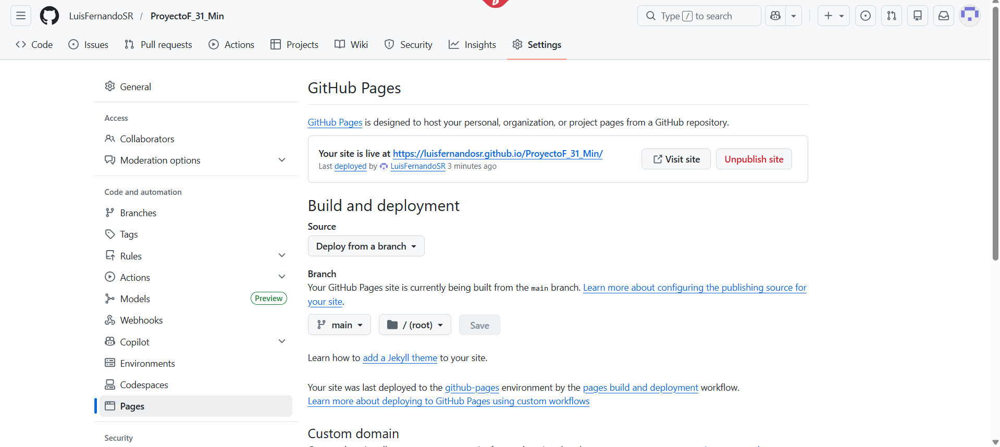
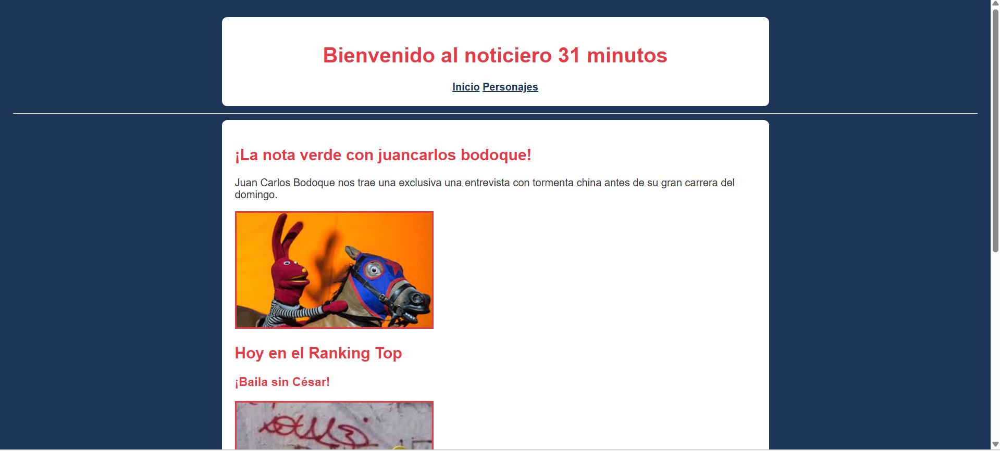
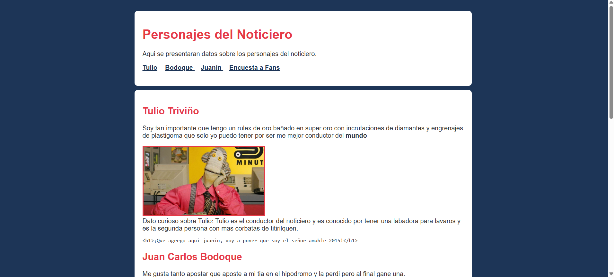

# 📂 Evidencias de Entrega - Luis Fernando

## 📸 Capturas de Pantalla

### Configuración de GitHub Pages
> 

### Vista del Sitio en el Navegador
> 
> 

---

## 🧠 Aprendizajes

### 1. ¿Qué fue lo más fácil y lo más retador?
- **Lo más fácil:** sSiento que los mas facil fueoOrganizar la jerarquía de títulos y párrafos, ya que el contenido de 31 Minutos es muy fluido y divertido de redactar.
- **Lo más retador:** Lo mas retador fue lograr que las rutas de las imágenes funcionaran correctamente en GitHub Pages, tuve que revisar que los nombres de las carpetas coincidieran exactamente en mayúsculas y minúsculas. Tambien intentar colocar un video ya que no lo logre asi que solo coloque el link.

### 2. ¿Qué etiquetas semánticas usaste y por qué?
Utilicé `<header>`, `<main>`, `<section>`, `<nav>` y `<footer>`. Las usé para darle una estructura lógica al sitio; por ejemplo, `<section>` me permitió separar claramente las noticias de la "Nota Verde" del "Ranking Top", lo cual ayuda a los lectores de pantalla a entender mejor el contenido.

### 3. ¿Cómo organizaste tus commits?
Seguí una estructura incremental:
1. `docs: inicialización del proyecto y estructura básica`
2. `feat: agrega contenido y secciones a index.html`
3. `feat: crea página de personajes y formulario`
4. `style: añade estilos css básicos y colores del tema`
5. `fix: corrige cierre de etiquetas y rutas de imágenes`
6. `docs: añade archivos README y EVIDENCIAS`

### 4. ¿Qué mejorarías en la siguiente iteración?
Me gustaría implementar un menú de navegación tipo "hamburguesa" para móviles y utilizar variables CSS (`:root`) para gestionar mejor la paleta de colores y permitir un modo oscuro. 

Me gustaria tambien mejorar un poco mi pagina agregando videos y mas infomacion sobre los personajes mejorando la estructura de mi pagina ya que para ser honestos creo que quedo algo fea :C.